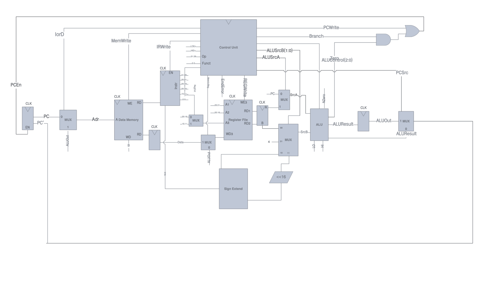

# MIPS_VHDL
An implementation of the MIPS Multi Cycle Processor using VHDL
 
In this project the module can detect:
* R-Format: add, sub, addu, subu, and, or, xor, nor, slt, sltu, jr, jalr, multu, mfhi, mflo
* I-Format: beq, bne, lw, sw, addi, addiu, slti, sltiu, andi, ori, xori, lui
* J-Format: j, jal

In total you can write an assembly text file(.txt) which contains upper orders, then use matlab function for implementing machine code that would be read by registerFile and configure the Ram Memory.

There is 2 example of assembly code in [example](example) folder. 
## Matlab
In this section as I mentioned, we want to creat machine code from assembly code. So we need a dictionary file to map each text word into its machine code ([asmDecoder.m](matlab/asmDecoder.m)) and finally use [asmTest.m](matlab/asmTest.m) to merge the machine codes.
## VHDL
The whole architecture of MIPS algorithm is:

by using this image the project would be more understandable.

## Timing
* Memory:
  * Address to Read-Data propagation delay: 7 ns
  * Write to Read/Write access time: 2 ns
  * Write-Data setup time: 0.1 ns
  * Write is controlled by positive edge of clock
* Register File:
  * Read-Register to Read-Data propagation delay: 2 ns
  * Write-Register & Write-Data setup time: 0.1 ns
* Registers:
  * Clock to Q delay: 0.1 ns
  * Input setup time: 0.1 ns
* ALU:
  * Inputs to Outputs propagation delay: 2 ns
* Multiplexers:
  * Inputs to Output propagation delay: 0.1 ns
 
## Testing
For an example use this assembly code:

the result after a while:

